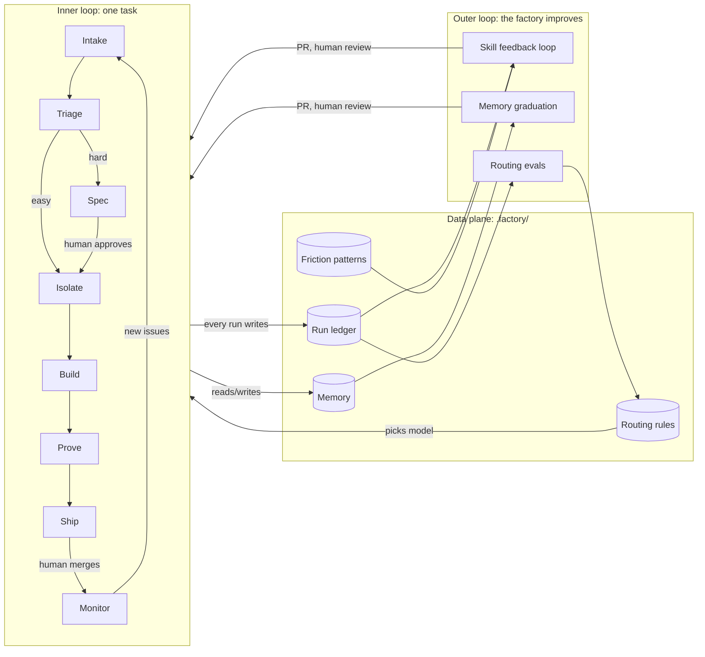
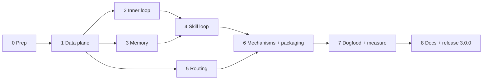

# Software Factory v3: implementation plan

v2 covers one task, one branch, one PR. It takes a task from an isolated
branch to a reviewed PR with evidence attached. v3 makes it a factory that
runs the whole lifecycle and gets better at it over time.

This plan is phased. Each phase ships as its own PR (or a small stack), built
with the v2 workflow in this repo: worktree, evidence, `code-review-loop` to
5/5. The factory builds the next version of itself from the first phase on.

Sources:

- `script.md`: talk on self-improving software factories (skill loops,
  persistent memory, model routing).
- `script2.md`: talk on the factory as the new unit of engineering (the
  lifecycle loop, human checkpoints, measure and improve, the data plane).
- `agent-native/`: BuilderIO's agent-native repo, used for patterns only (see
  [Provenance](#provenance)).

---

## 1. What v3 is, in one paragraph

v2 is an inner loop. It answers "how does one agent ship one change with
proof." v3 adds the rest of the factory floor on both sides of that loop:
intake and triage before it, monitoring after it, and a data plane under it.
It also adds an outer loop that watches the inner loop and improves it. That
outer loop does three things: it rewrites skills that keep failing, it stores
facts so agents stop re-learning them, and it routes each class of task to the
cheapest model that does it well. Every improvement lands as a reviewed PR, so
a human approves each one and git records the history.



## 2. Design principles

These come from the two talks and from agent-native, and every phase has to
respect them.

1. **Every improvement is a PR.** The outer loop never edits a skill, memory,
   or routing rule in place. It opens a PR, a human reviews it, and git keeps
   the history. (script.md: "all of the improvements to the inner loop skill
   are going to be tracked through git.")
2. **No signal, no rule.** A skill change has to name the measured pattern it
   should move and the baseline number. If nothing measures it, it does not
   ship. (agent-native `AGENTS.md`, "Checks" section.)
3. **Use a mechanism once prose has failed twice.** If a rule keeps getting
   broken, replace it with a script, hook, or check. Do not reword it again,
   and delete the old prose in the same change.
4. **Data lives in the repo.** The data plane is plain files under
   `.factory/`: versioned, diffable, and editable by humans. No database and
   no hosted service are required. That keeps v3 harness-agnostic, like v2.
5. **Humans sit at the checkpoints.** Spec approval, merge, and outer-loop
   proposals are human gates. Everything between them is automated.
6. **Measure the factory.** Record throughput, cost per merged PR, review
   rounds, and human touches for every run, so a claim like "v3 is better"
   has numbers behind it.
7. **Keep AGENTS.md small.** It holds the invariants plus a skills index near
   the top. Depth goes into skills.
8. **Stay harness-agnostic.** Skills must work in Claude Code, Codex, Cursor,
   and the rest. Harness-specific extras (hooks, plugins) are optional
   accelerators, never requirements.

## 3. Gap analysis: v2 to v3

| Factory component (script2.md) | v2 today | v3 adds |
|---|---|---|
| Inputs / intake | Nothing. A human hands over the task. | `issue-triage` plus a workflow that runs on new issues |
| Triage | Nothing | `issue-triage`: implement, spec, dedupe, or ask for missing info |
| Spec | Nothing | `spec-writing`: product spec plus tech spec, with a human approval gate |
| Implementation | `worktree-isolation`, `service-layer` | Unchanged, plus a sibling-bug sweep section in `service-layer` |
| Review | `code-review-loop(-large)` | Unchanged (vendored). Review rounds and comments go into the ledger. |
| Verification | `test-evidence`, `visual-diff` | "Done or BLOCKED" contract, proof scaled to change size |
| Ship | PR plus 5/5 | Unchanged |
| Monitor | Nothing | `release-monitoring`: post-merge checks, and regressions become new issues |
| Data plane | Nothing | `.factory/` with the ledger, memory, routing, and friction patterns |
| Skill loop (script.md) | Nothing | `skill-feedback-loop` plus `friction-report.mjs` |
| Persistent memory (script.md) | Nothing | `agent-memory`, with provenance and "memories used" reporting |
| Model routing (script.md) | Nothing | `model-routing`: tier rules plus a best-of-k eval runner |
| Measure and improve (script2.md) | Nothing | `run-ledger` report: cost, throughput, human touches |
| Automations | Nothing | GitHub Actions templates, Claude Code plugin hooks |
| Bootstrap in a new repo | Copy `AGENTS.md` by hand | `factory-setup` |

## 4. Target inventory

### Skills (18 = 10 kept + 8 new)

No existing skill is renamed or removed, because the folder name is the
install path.

| Skill | Status | Loop | Beat |
|---|---|---|---|
| `issue-triage` | new | inner | 0 Triage |
| `spec-writing` | new | inner | 1 Spec |
| `worktree-isolation` | kept | inner | 2 Isolate |
| `service-layer` | updated | inner | 3 Build |
| `test-evidence` | updated | inner | 4 Prove |
| `visual-diff` | kept (vendored) | inner | 5 Ship |
| `code-review-loop` | kept (vendored) | inner | 5 Ship |
| `code-review-loop-large` | kept (vendored) | inner | 5 Ship |
| `release-monitoring` | new | inner | 6 Monitor |
| `run-ledger` | new | data plane | every beat |
| `agent-memory` | new | data plane / outer | every beat |
| `skill-feedback-loop` | new | outer | scheduled |
| `model-routing` | new | outer | every beat |
| `factory-setup` | new | meta | once per repo |
| `prose-cleanup` | kept (vendored) | cross-cutting | |
| `skill-authoring` | updated | meta | |
| `package-release` | updated | meta | |
| `cross-platform-shell` | kept | meta | |

Vendored skill bodies stay untouched, as v2 promised in `NOTICE.md`. v3
connects them through `AGENTS.md` and the ledger, not by editing them.

### Repo layout after v3

```text
AGENTS.md                         <- v3 workflow: inner loop + outer loop
.claude-plugin/
  plugin.json                     <- optional Claude Code plugin (skills + hooks + commands)
  marketplace.json
.codex-plugin/plugin.json         <- optional Codex plugin manifest
commands/                         <- slash commands: /triage, /spec, /factory-loop, /factory-report
hooks/                            <- hook scripts the plugin registers
schemas/                          <- JSON Schemas for every .factory/ file
  run.schema.json
  memory.schema.json
  routing.schema.json
  friction-patterns.schema.json
skills/
  issue-triage/SKILL.md
  spec-writing/SKILL.md
    references/product-spec.md
    references/tech-spec.md
  release-monitoring/SKILL.md
  run-ledger/SKILL.md
    scripts/ledger.mjs            <- start | beat | finish | report
  agent-memory/SKILL.md
    scripts/memory.mjs            <- add | search | use | prune | graduate
  skill-feedback-loop/SKILL.md
    scripts/friction-report.mjs   <- transcript scan, pattern counts per owning skill
    scripts/collect-signals.mjs   <- PR review comments, ledger, memory into one signal file
    references/proposal-template.md
  model-routing/SKILL.md
    scripts/route.mjs             <- resolve a task to a tier
    scripts/route-eval.mjs        <- best-of-k comparison harness
  factory-setup/SKILL.md
    assets/workflows/*.yml        <- triage, weekly loop, post-merge monitor
    assets/factory/               <- starter .factory/ contents
  ...the ten v2 skills
scripts/
  lint-skills.mjs                 <- + new frontmatter rules, AGENTS.md index drift check
  check-package.mjs               <- + plugin files, schemas
  check-factory.mjs               <- validates any .factory/ dir against schemas/
tests/
  test_record.py                  <- existing
  node/*.test.mjs                 <- node:test suites for every new script
docs/
  V3-PLAN.md                      <- this file
  MIGRATION-v3.md
  how-it-works.md                 <- rewritten for two loops
```

A repo that adopts the factory gets this directory (created by
`factory-setup`):

```text
.factory/
  config.json                     <- which beats are on, human gates, loop cadence
  runs/2026-10-02-fix-login-3f2a.json
  memory/INDEX.md
  memory/windows-symlink-install.md
  routing.json
  friction-patterns.json
  proposals/                      <- outer-loop drafts before they become PRs
```

---

## 5. Data contracts

Phase 1 fixes these contracts, and every later phase builds on them. Each
contract gets a JSON Schema in `schemas/` and a validator in
`scripts/check-factory.mjs`.

### Run record (`.factory/runs/<id>.json`)

One file per task, written by the agent at each beat through `ledger.mjs`.

```json
{
  "schema": 1,
  "id": "2026-10-02-fix-login-3f2a",
  "task": { "source": "github:issue/123", "class": "bugfix", "size": "small" },
  "harness": "claude-code",
  "model": { "tier": "balanced", "id": "claude-sonnet-5-5", "rule": "routing.json#bugfix-small" },
  "beats": {
    "triage": { "decision": "implement" },
    "spec": null,
    "prove": { "evidence": ["recording", "output-pair"], "before_captured": true },
    "ship": { "pr": 45, "review_rounds": 2, "final_score": "5/5" },
    "monitor": { "status": "clean", "checked_at": "2026-10-03T09:00:00Z" }
  },
  "memories": { "used": ["windows-symlink-install"], "written": ["ci-ffmpeg-apt"] },
  "human_touches": [
    { "beat": "ship", "kind": "correction", "ref": "https://github.com/o/r/pull/45#discussion_r998" }
  ],
  "cost": { "input_tokens": 812000, "output_tokens": 41000, "usd": null },
  "started_at": "2026-10-02T10:14:00Z",
  "finished_at": "2026-10-02T10:56:00Z",
  "outcome": "merged"
}
```

`cost` fields are nullable. Harnesses that log token usage (Claude Code and
Codex session JSONL) fill them in. Others leave them null, and reports say
"unknown" instead of reporting zero.

### Memory entry (`.factory/memory/<slug>.md`)

```markdown
---
name: windows-symlink-install
type: pitfall            # fact | pitfall | decision | reference
source: https://github.com/o/r/pull/41
run: 2026-09-12-install-docs-9c1f
created: 2026-09-12
last_used: 2026-09-28
uses: 3
status: confirmed        # observed | confirmed | stale
---
`npx skills add` fails on Windows without Developer Mode. Retry with `--copy`
before debugging anything else.
```

`INDEX.md` has one line per memory and is the only file loaded at task start.
Bodies are read on demand.

### Routing rules (`.factory/routing.json`)

Rules map a task class to a tier, not to a vendor model ID. Each harness maps
tiers to its own models in `tiers`, so the rules outlive model releases.

```json
{
  "schema": 1,
  "tiers": {
    "fast":     { "claude-code": "haiku",  "codex": "gpt-mini" },
    "balanced": { "claude-code": "sonnet", "codex": "gpt" },
    "frontier": { "claude-code": "opus",   "codex": "gpt-high" }
  },
  "default": "balanced",
  "rules": [
    { "id": "triage",       "match": { "beat": "triage" },        "tier": "fast" },
    { "id": "docs",         "match": { "class": "docs" },         "tier": "fast" },
    { "id": "ci-fix-small", "match": { "class": "ci-fix", "size": "small" }, "tier": "fast" },
    { "id": "migration",    "match": { "class": "migration" },    "tier": "frontier" },
    { "id": "spec",         "match": { "beat": "spec" },          "tier": "frontier" }
  ],
  "evidence": { "ci-fix-small": ".factory/evals/2026-10-10-ci-fix.json" }
}
```

### Friction pattern (`.factory/friction-patterns.json`)

```json
[
  {
    "key": "false-done",
    "label": "Human had to say it was not actually fixed",
    "owner": "test-evidence",
    "re": "(still (broken|failing|not working)|you said (it was )?fixed)",
    "added": "2026-10-05"
  }
]
```

Every outer-loop proposal cites one of these keys.

---

## 6. Phases

Sizes assume one person directing agents. Phases 2, 3, and 5 can run in
parallel in separate worktrees once Phase 1 has merged.



| Phase | Size | Output |
|---|---|---|
| 0. Prep and baseline | 0.5 day | Clean tree, v2 baseline numbers, ADR |
| 1. Data plane | 2 days | `.factory/` contracts, `run-ledger`, `check-factory.mjs` |
| 2. Inner loop expansion | 3 days | `issue-triage`, `spec-writing`, `release-monitoring`, v3 `AGENTS.md` |
| 3. Persistent memory | 2 days | `agent-memory`, `memory.mjs` |
| 4. Skill feedback loop | 3 days | `skill-feedback-loop`, friction report, proposal PRs |
| 5. Model routing | 2 days | `model-routing`, `route.mjs`, `route-eval.mjs` |
| 6. Mechanisms and packaging | 3 days | Plugin, hooks, commands, workflows, `factory-setup` |
| 7. Dogfood and measure | 2 weeks elapsed | Real ledger data, first loop PRs, before/after numbers |
| 8. Docs and release | 1 day | README, how-it-works, migration guide, 3.0.0 on npm |

---

### Phase 0: prep and baseline

Goal: a clean starting point, and v2 numbers to compare v3 against.

Tasks

1. Stop tracking the source material. Add `agent-native/` to `.gitignore`.
   It is a nested git checkout with about 23,000 files and must never reach a
   commit or the npm tarball. Move `script.md` and `script2.md` to
   `docs/research/` (or gitignore them too, if you don't want to publish the
   transcripts).
2. Record the provenance decision in `NOTICE.md`: agent-native patterns are
   used as inspiration only (see [Provenance](#provenance)).
3. Write `docs/adr/0001-v3-factory.md`. It records five choices: data in
   files, not a service; tiers, not model IDs; the outer loop proposes but
   never merges; vendored skills stay untouched; no renames.
4. Capture the v2 baseline, which is the "before" half of the v3 evidence:
   - `node scripts/lint-skills.mjs` output (skill count, warnings)
   - `npx skills add . --list` output
   - `npm pack --dry-run --json` file count and size
   - the byte size of `AGENTS.md`, plus a count of lines that are always
     loaded
   - a timed run of one real task through v2, with rounds, human touches,
     and tokens noted by hand. There is no ledger yet, so this manual record
     is the baseline.
5. Create the `v3` tracking issue with one checkbox per phase. Each phase
   later links its PR there.

Acceptance

- `git status` shows no `agent-native/` entries.
- `npm pack --dry-run` has the same file count as before.
- `docs/research/v2-baseline.md` exists with the numbers above.

---

### Phase 1: data plane

Goal: the shared files every later phase reads and writes. Nothing else can
be measured until this exists.

Deliverables

- `schemas/run.schema.json`, `memory.schema.json`, `routing.schema.json`,
  `friction-patterns.schema.json`, and `config.schema.json`.
- `scripts/check-factory.mjs <dir>`. It validates a `.factory/` dir against
  the schemas. It has three outcomes (0 passed, 1 failed, 2 could not run),
  and it never reports "passed" when it inspected nothing. This is
  agent-native's rule against silent success.
- `skills/run-ledger/`:
  - `SKILL.md`. It says when to call the ledger (start of the task, end of
    each beat, finish). It defines the task classes (`bugfix`, `feature`,
    `refactor`, `docs`, `ci-fix`, `migration`, `perf`, `chore`) and sizes
    (`small`, `medium`, `large`, with rules of thumb). It also covers what
    counts as a human touch.
  - `scripts/ledger.mjs` with these subcommands:
    - `start --class --size --source` prints a run id.
    - `beat <id> <beat> --json '{...}'` merges one beat into the record.
    - `touch <id> --beat --kind --ref` records a human intervention.
    - `finish <id> --outcome` sets `finished_at` and pulls token usage from
      the harness transcript when it can find one.
    - `report [--since 14d]` prints throughput, merged PRs, median review
      rounds, human touches per PR, first-pass evidence rate, tokens per
      merged PR, and outcomes by class.
  - Node 18+, zero dependencies, POSIX and Windows paths
    (`cross-platform-shell` rules).
- `tests/node/ledger.test.mjs` and `check-factory.test.mjs` (built-in
  `node:test`, no new dependencies).
- `package.json`: `test` runs `node --test tests/node/` too, and `files`
  gains `schemas/`.
- CI: a new `node-tests` job on all three OSes.

Acceptance

- `ledger.mjs start … beat … finish` produces a file that passes
  `check-factory.mjs`. A hand-broken file fails it with a precise message. An
  empty dir exits 2.
- `ledger.mjs report` on a fixture of about 10 runs prints the expected
  numbers, and a test asserts them.
- Token extraction works on a real Claude Code JSONL transcript fixture and
  falls back to `null` otherwise.
- `lint-skills.mjs` stays at 0 errors, and `npx skills add . --list` finds 11
  skills.

Risks

- Agents forget to call the ledger. Phase 1 accepts that. Phase 6 adds hooks
  and a PR-body check. Principle 3 applies: do not fix this with more prose.

---

### Phase 2: inner loop expansion

Goal: cover the whole lifecycle from script2.md: triage, spec, and monitor
around the existing beats.

Deliverables

1. `skills/issue-triage/SKILL.md`
   - Input: a GitHub issue, a Slack message, a pasted report, or a failed
     monitor check.
   - It returns exactly one decision, with a reason:
     - `implement`: small and unambiguous, go straight to Isolate.
     - `spec`: ambiguous, cross-cutting, or product-visible, go to Spec.
     - `duplicate`: link the original and close.
     - `needs-info`: ask for the specific missing fields (repro steps,
       version, expected vs actual) and label the issue. Never ask a generic
       "can you give more details".
     - `decline`: out of scope, with the reason.
   - It searches `agent-memory` and closed issues before deciding, which
     gives the dedupe check from script.md.
   - It writes the decision to the ledger and labels the issue
     (`factory:implement`, `factory:spec`, and so on).
   - Default tier: `fast`.
2. `skills/spec-writing/SKILL.md` plus two references:
   - `product-spec.md`: the problem, users, invariants the product must
     keep, user-visible behavior, non-goals, and acceptance checks written
     so that `test-evidence` can prove each one.
   - `tech-spec.md`: the current shape, the proposed shape (with the
     boundary and service split from `service-layer`), files touched, data
     and migration, risks, rollout, and the test plan.
   - Human gate: the spec is posted as a PR (`specs/<slug>.md`) or an issue
     comment, and implementation waits for approval. Approval is recorded in
     the ledger as a human touch of kind `approval`.
3. `skills/release-monitoring/SKILL.md`
   - After merge it checks the CI result on the default branch, deploy
     status if the repo has one, and error and crash sources if the repo
     names them in `AGENTS.md`. It also re-runs the PR's own evidence
     command against the deployed build when that is cheap.
   - A clean result writes `monitor.status = clean` to the ledger.
   - A regression opens a new issue that links the PR and the evidence and
     is labeled `factory:regression`. That issue feeds back into Triage.
   - It defines how long to watch, when to stop, and never to leave a
     watcher running after the check is done.
4. `test-evidence` update (v2.0 to v3.0):
   - A turn ends in exactly one of two shapes: Done, with the artifact, or
     `BLOCKED: <what> - unblock: <one action>`. Anything else is a stall.
   - A proof table scaled by size: a small change gets its narrowest check,
     and only cross-cutting work escalates to the full suite.
   - It writes the evidence kinds and `before_captured` to the ledger.
5. `service-layer` update: a short "sweep for siblings" section. When a bug
   comes from a pattern, find every instance before fixing any of them, and
   list the full blast radius in the PR. This is original wording, drawing
   on agent-native `fix-at-the-boundary` for the idea only.
6. `AGENTS.md` v3 (draft, finalized in Phase 8):
   - Purpose line, then the skills index, which has to come second.
   - The inner loop in seven beats: 0 Triage, 1 Spec (when triage says so),
     2 Isolate, 3 Build, 4 Prove, 5 Ship, 6 Monitor.
   - The outer loop: Remember (every task), Route (every task), Improve
     (scheduled).
   - Human gates: spec approval, merge, and outer-loop PRs.
   - A "Done or BLOCKED" final line.
   - Target under 6,000 characters for the always-loaded part. A lint rule
     enforces it.

Acceptance

- Each new skill passes the linter, has a "Use when" trigger, stays under
  260 body lines, and does not overlap another description by more than 75%.
- A dry run on three real issues from this repo produces one of each
  decision (`implement`, `spec`, `needs-info`). The ledger records and issue
  labels are the evidence.
- One `spec` issue produces a product and tech spec that a human approves
  before code starts.
- One merged PR gets a `release-monitoring` pass recorded in its run file.

---

### Phase 3: persistent memory

Goal: agents stop re-learning facts. script.md describes a fact store scoped
to the agent, with provenance, versioning, human edits, and a report of which
memories were used. v3 gets all of that from plain files in git.

Deliverables

- `skills/agent-memory/SKILL.md`
  - Read `.factory/memory/INDEX.md` at the start of every task. It is one
    line per memory, so it stays small.
  - Before re-deriving something (a root cause, a flaky test, an environment
    quirk), `search` memory first.
  - At the end of a task, write only durable facts: pitfalls, decisions,
    environment quirks, and pointers. Skip anything obvious from the code,
    anything already in `AGENTS.md` or a skill, and temporary debugging
    notes. The types are adapted from agent-native `capture-learnings`:
    fact, pitfall, decision, reference.
  - Every memory carries provenance (`source` PR or issue, and `run` id).
  - The PR body gets a "Memories used" line and a "Memories written" line.
    That makes memory use visible to reviewers, as in the Oz demo.
  - New memories ship in the same PR as the change, so the human reviews
    them with the code. No memory is written outside git.
  - Graduation: once a memory has `uses >= 3`, propose moving it into the
    owning skill or `AGENTS.md`, then delete the memory. Phase 4 automates
    this.
- `skills/agent-memory/scripts/memory.mjs`:
  - `add --name --type --source --body` writes the file and index line. It
    refuses duplicate names and warns on near-duplicate bodies.
  - `search <terms>` ranks by keyword over name, index line, and body. No
    embeddings, no dependencies.
  - `use <name> --run <id>` bumps `uses` and `last_used` and appends to the
    run record.
  - `prune --unused-days 90` marks stale entries, never deletes them, and
    prints what it marked.
  - `graduate` lists candidates with their use count and the likely owning
    skill.
- Tests for each subcommand, including Windows paths and CRLF input.

Acceptance

- Replay test: a scripted two-run fixture where run 2 hits the same root
  cause as run 1. With memory, run 2's ledger shows `memories.used` and
  fewer steps or tokens. Without it, run 2 re-derives the cause. That pair
  is the before/after evidence.
- `check-factory.mjs` validates the memory frontmatter and fails on missing
  provenance.
- `INDEX.md` stays under a size budget (for example 4 KB), and the linter
  warns past it.

Risks

- Memory rot, where facts go stale. It is handled by `last_used`, `prune`,
  and `status: stale`, and every entry links its source, so a human can
  check it.
- Secrets leaking into memory. The skill says never to store credentials or
  customer data, and `check-factory.mjs` runs a high-confidence secret regex
  over memory bodies.

---

### Phase 4: skill feedback loop

Goal: the headline feature from script.md. An outer-loop agent watches how
the inner-loop skills perform, finds repeated failures, and opens a reviewed
PR that improves the skill that owns them.

Deliverables

- `skills/skill-feedback-loop/scripts/friction-report.mjs`
  - It scans harness transcripts (`~/.claude/projects/**/*.jsonl` and
    `~/.codex/sessions/**/*.jsonl`) for the last N weeks, only for the
    current repo's sessions.
  - It matches user turns against `.factory/friction-patterns.json` and
    prints counts per key, the owning skill, the trend compared with the
    previous window, and up to three sample quotes per key.
  - A `--json` mode feeds `collect-signals.mjs`.
  - It ships a starter pattern set of about 8 keys: `false-done`,
    `no-before-evidence`, `worked-on-main`, `stale-branch`, `status-chase`,
    `unrequested-scope`, `review-comment-repeat`, and `ai-prose`, each owned
    by a v3 skill. The regexes are written fresh. The only idea borrowed
    from agent-native's `agent-friction-report.mjs` is one registry keyed by
    owner.
  - Transcripts stay local. The script prints aggregates and short quotes
    and never uploads anything.
- `scripts/collect-signals.mjs` combines four sources into
  `.factory/proposals/signals-<date>.json`:
  - friction counts (above)
  - ledger aggregates: review rounds by class, false-done rate, human
    touches by beat
  - PR review comments on merged factory PRs (`gh api`), grouped by the file
    or skill they concern. This covers script2.md's example of senior
    engineers correcting review comments.
  - memory graduation candidates
- `skills/skill-feedback-loop/SKILL.md`, the outer-loop procedure:
  1. Run `collect-signals`.
  2. Pick the top signal that is climbing and has at least 2 independent
     occurrences. One incident is not a pattern.
  3. Read the owning skill. If existing guidance already covers the failure,
     do not restate it. Propose a mechanism instead (a script, check, or
     hook), per principle 3.
  4. Draft the smallest change to one skill (or one memory graduation) in
     `.factory/proposals/<date>-<key>.md` using
     `references/proposal-template.md`. The template has five parts:
     Signal (counts and links), Diagnosis, Change, Expected movement
     (pattern key, baseline, target), and Rollback.
  5. Open a PR with the `factory:skill-loop` label. Each PR touches one
     skill, runs the linter, and follows the full v2 ship beat.
  6. Stop. A human merges or closes it.
  7. On the next run, compare the key's count with the baseline in the
     merged proposal and report whether it moved. If a change did not move
     its number in two windows, flag it for revert.
- Guardrails, all enforced in `SKILL.md` and by the linter where possible:
  - Never edit a vendored skill body. For a vendored owner, propose an
    `AGENTS.md` note or a wrapper instead.
  - Never touch `description` and body in the same PR unless the signal is
    "skill never triggers". Keep each change small enough to attribute.
  - Never merge. Never push to a PR it did not open.
  - A new rule must add or cite a friction key ("no key, no rule").
- `skill-authoring` update: a section on reviewing loop proposals, plus
  `metadata.signals: [keys]` so each skill lists the friction keys it owns.
  The linter checks that every key in `friction-patterns.json` has an owner
  skill that exists.

Acceptance

- On a fixture of transcripts and ledger data with a planted pattern (for
  example 5 `false-done` hits in 2 weeks), the loop produces one proposal
  targeting `test-evidence` with the correct counts and a lint-clean diff.
- On live data from this repo, at least one real proposal PR is opened and
  reviewed. Merging it is optional, since the evidence is the proposal
  quality.
- The friction report runs on Windows and POSIX and finishes in under 10
  seconds on 2 weeks of transcripts.

Risks

- Loop churn, where the loop keeps rewriting the same skill. It is limited
  to one open `factory:skill-loop` PR per skill, a cooldown of 2 windows
  after a merge, and the rule that a change must move its number.
- Noisy regex matches. Every pattern ships with positive and negative test
  sentences (agent-native does this), and `node --test` runs them.

---

### Phase 5: model routing

Goal: cheap tasks run on cheap models, hard tasks on strong ones. Those
decisions come from evals and get revisited as models change (script.md).

Deliverables

- `skills/model-routing/SKILL.md`
  - A default tier table:

    | Work | Tier |
    |---|---|
    | Triage, labeling, dedupe | fast |
    | Mechanical sweeps, docs, small CI fixes | fast |
    | Implementation slices, test/fix loops, PR babysitting, browser checks | balanced |
    | Specs, architecture, ambiguity calls, final review | frontier |

  - The main thread plans and reviews, and cheaper subagents do the slices.
    This is the idea from agent-native `delegating-work`, rewritten
    harness-neutral.
  - How to apply a tier in each harness: Claude Code subagent `model`, Codex
    profiles, Cursor model picker, or CI env vars. Where a harness cannot
    switch models, record the tier anyway, so the data still accrues.
  - Record the tier, model, and rule id in the run ledger every time.
- `scripts/route.mjs --beat --class --size` prints the tier and the model
  for the current harness, plus the matched rule id.
- `scripts/route-eval.mjs`, a best-of-k harness from script.md:
  - Input: a small task set (`.factory/evals/<class>/*.md`, each a prompt
    plus a check command) and a list of tiers.
  - For each task and tier, run k attempts in throwaway worktrees through a
    configurable agent command (`claude -p`, `codex exec`, and so on),
    then run the check command.
  - Output: pass rate, tokens, and wall time per tier, written to
    `.factory/evals/<date>-<class>.json`, plus a recommendation: the
    cheapest tier within X points of the best pass rate.
  - It never edits `routing.json`. The skill feedback loop turns eval
    results into a routing PR, so routing changes get the same human gate.
- `.factory/routing.json` default, shipped by `factory-setup`.

Acceptance

- `route.mjs` resolves every rule in a fixture and falls back to `default`.
  Unit tests cover that.
- One real eval on this repo: 5 small tasks (for example lint fixes or doc
  typos) run at k=3 on `fast` and `balanced`, with a result file and a
  routing PR that either changes a rule or records "no change" with the
  numbers.
- `ledger.mjs report` breaks cost and outcome down by tier.

Risks

- Evals cost money. `route-eval.mjs` has a `--budget-tokens` cap and a
  `--dry-run` that prints the planned attempts. It never runs in CI by
  default, only on manual dispatch.
- Model names change. Tiers absorb that, and only the `tiers` map needs
  updating.

---

### Phase 6: mechanisms and packaging

Goal: turn the rules that agents forget into things that run automatically,
and make v3 installable as a plugin as well as through `npx skills`.

Deliverables

1. Claude Code plugin (optional path; `npx skills add` keeps working):
   - `.claude-plugin/plugin.json` pointing at `skills/`, `commands/`, and
     `hooks/`, plus `.claude-plugin/marketplace.json`, so users can run
     `/plugin marketplace add aditya-deokar/software-factory`.
   - Hooks. They are short Node scripts, cross-platform, and fail open,
     meaning they never block work on a hook bug:
     - `SessionStart`: print `.factory/memory/INDEX.md` and the current
       routing default, so memory reads no longer depend on the agent
       remembering.
     - `Stop`: if the branch has a run record with no `finish`, remind the
       agent to finish it. If the last message is neither Done with an
       artifact nor `BLOCKED:`, say so.
     - `PreToolUse` on `git push`: refuse to push to `main` or `master`.
       This turns an `AGENTS.md` rule into a mechanism.
   - Commands: `/triage <issue>`, `/spec <issue>`, `/factory-loop`,
     `/factory-report`, `/sidecar <question>` (a read-only investigator
     with a strict no-edit contract, inspired by agent-native's `sidecar`).
2. `.codex-plugin/plugin.json` with the same skills. Hooks are documented as
   Claude-only.
3. `skills/factory-setup/` bootstraps a target repo:
   - It creates `.factory/` from `assets/factory/` and appends a
     repo-specific section to the target's `AGENTS.md`: commands and checks,
     invariants, monitoring sources, and human gates.
   - It optionally installs `assets/workflows/`:
     - `factory-triage.yml`: on `issues: opened`, run the triage skill
       headless (`anthropics/claude-code-action` or a Codex equivalent,
       selected by a repo variable) and post the decision and labels.
     - `factory-loop.yml`: weekly cron plus manual dispatch that runs
       `skill-feedback-loop` and opens at most one PR.
     - `factory-monitor.yml`: on push to the default branch, run the
       `release-monitoring` checks that need no secrets, and open a
       regression issue on failure.
     - Each workflow has `permissions:` scoped to the minimum, a
       concurrency group, and a gate that skips forks and drafts.
   - It is idempotent: running it twice changes nothing, and it prints what
     it would change before changing it.
4. Tooling:
   - `lint-skills.mjs`:
     - The always-loaded part of `AGENTS.md` stays under 6,000 characters.
     - Every skill appears in the `AGENTS.md` index and in the README, and
       vice versa (drift guard).
     - Every hook in `plugin.json` exists on disk.
     - Every friction key has an owner.
   - `check-package.mjs`: `.claude-plugin/`, `commands/`, `hooks/`, and
     `schemas/` ship, and `agent-native/` and `docs/research/` do not.
   - CI: validate the plugin manifest JSON, and add a smoke test that runs
     `factory-setup` into a temp repo and then `check-factory.mjs` on the
     result.

Acceptance

- `/plugin install` from a local marketplace path works in Claude Code. The
  SessionStart hook output shows up in a fresh session (screenshot or
  transcript excerpt).
- The pre-push hook blocks a push to `main` in a scratch repo, and the
  command output is the evidence.
- `factory-setup` on an empty scratch repo produces a valid `.factory/` and
  three workflows. A second run prints "no changes".
- The triage workflow runs on a test issue in a fork or sandbox repo and
  posts a decision.

---

### Phase 7: dogfood and measure

Goal: prove v3 makes the factory better, with numbers. The package is about
evidence over assertion, so the release has to meet the same bar.

Tasks

1. Run `factory-setup` on this repo. Turn on triage, monitor, and the weekly
   loop.
2. For two weeks, run all work on this repo through v3. Also run it on at
   least one other real project, so the numbers are not only about editing
   markdown.
3. Run `ledger.mjs report --since 14d`, run `friction-report`, and let the
   loop open its PRs.
4. Compare against the Phase 0 baseline:

   | Metric | v2 baseline | v3 after 2 weeks |
   |---|---|---|
   | Median review rounds to 5/5 | | |
   | Human touches per merged PR | | |
   | "Not actually fixed" corrections (`false-done`) | | |
   | Tokens per merged PR | | |
   | Share of tasks on `fast` tier | 0% | |
   | Re-derived root causes that memory already had | | |
   | Skill-loop PRs opened / merged / reverted | n/a | |

5. Record what did not work and fix it before release, or list it as a
   known limitation.

Acceptance

- `docs/research/v3-results.md` holds the filled table with links to ledger
  reports and loop PRs.
- At least one skill-loop PR merged and at least one routing decision backed
  by an eval file.

---

### Phase 8: docs and release 3.0.0

Tasks

1. Finalize `AGENTS.md` v3, run `prose-cleanup` on it, and check its size
   with the linter.
2. Rewrite the README first screen around the two loops. Update the skill
   count badge (18), the skills section (grouped Inner loop, Outer loop,
   Data plane, Craft), and install paths (`npx skills` and plugin).
3. Rewrite `docs/how-it-works.md` for v3, with the diagram from section 1
   and each new skill.
4. Write `docs/MIGRATION-v3.md` for v2 users:
   - Nothing is renamed, so existing installs keep working.
   - To adopt v3, run `factory-setup`, then merge your repo-specific
     `AGENTS.md` section into the new template.
   - Every v3 addition is opt-in, beat by beat, through `.factory/config.json`.
5. Update `docs/USAGE.md` and `docs/BENEFITS.md` (the honest cost and value
   of each new skill), `NOTICE.md` (inspiration credits), and `ROADMAP.md`
   (mark v3 done and add v3.x follow-ups).
6. Run `package-release` for 3.0.0: bump `package.json`, set
   `metadata.version` on each changed skill, write `CHANGELOG.md`, run
   `npm pack --dry-run`, publish, tag `v3.0.0`, and create a GitHub release
   with the Phase 7 table in the notes.

Why this is a major version even though nothing is renamed: the `AGENTS.md`
contract changes from 4 beats to 7 plus an outer loop, and PRs now carry
ledger and memory lines. Anyone who copied the v2 `AGENTS.md` into a repo
needs the migration guide.

Acceptance

- CI green on all jobs and all three OSes.
- `npx skills add aditya-deokar/software-factory --list` from a temp dir
  lists 18 skills.
- `npm view @software-factory/skills version` prints `3.0.0`.

---

## 7. Provenance

- `agent-native/` has no license file at its root, and its `package.json`
  says ISC. v2 already paid the price of copying from an unlicensed source
  (three skills rewritten; see `ROADMAP.md`). v3 does not repeat that: no
  text, regex, or code is copied from `agent-native/`. Ideas and structure
  are fair to reuse. Every v3 file is written fresh, and `NOTICE.md` credits
  BuilderIO/agent-native as inspiration.
- The ideas taken from it: friction patterns tied to an owning skill, the
  "no key, no rule" discipline, Done/BLOCKED turn shapes, proof scaled to
  change size, memory types and graduation, tiered delegation, the sibling
  sweep, a read-only sidecar contract, three-outcome guards, a size budget
  for `AGENTS.md` with the skills index placed early, plugin and marketplace
  manifests, and hooks as mechanisms.
- The talk transcripts are source notes, not package content. Keep them out
  of the tarball (Phase 0 and the `check-package.mjs` rule in Phase 6).

## 8. Risks across the whole plan

| Risk | Mitigation |
|---|---|
| v3 feels heavy for a solo dev on a small repo | Every beat and loop is opt-in through `.factory/config.json`. v2 behavior is the default with everything off. |
| The ledger is only as good as agents' discipline | Hooks in Phase 6, plus a PR-body check that fails when a factory PR has no run id |
| The outer loop degrades skills | One skill per PR, human merge, a number that has to move, auto-flag for revert |
| Transcript scanning feels invasive | Local only, opt-in, prints aggregates, never uploads, documented in the skill |
| Harness differences (hooks, model switching) | Skills and scripts are the portable core. Hooks and plugins are extras, and each skill says what it does without them. |
| Scope creep into building a hosted platform | Out of scope (below). Files in git are the data plane. |
| Vendored-license regressions | The existing `check-package.mjs` rules stay, and new paths are added to its allowlist |

## 9. Out of scope for 3.0

- A hosted dashboard or database. A future `factory-report --html` could
  render the ledger as a static page.
- Embedding-based memory search. Keyword search over a small index is
  enough until the numbers show otherwise.
- Autonomous merging by the outer loop.
- Product-review automation (computer-use QA of the deployed app beyond
  what `test-evidence` already does). This is a candidate for 3.x.
- A public factory board like build.warp.dev. It could be a 3.x
  `factory-report --board` over issues labeled `factory:*`.

## 10. Decisions to confirm before Phase 1

1. Skill names. The proposed names follow v2's "standard engineering terms"
   convention: `issue-triage`, `spec-writing`, `release-monitoring`,
   `run-ledger`, `agent-memory`, `skill-feedback-loop`, `model-routing`,
   `factory-setup`. Names are permanent once published.
2. Whether specs live as files (`specs/<slug>.md` in a PR) or as issue
   comments. Files are recommended, since they are reviewable and versioned.
3. Whether to publish the talk transcripts under `docs/research/` or keep
   them local and gitignored.
4. The default agent for the GitHub Actions templates:
   `anthropics/claude-code-action`, Codex, or both behind a variable.
5. Whether plugin distribution (Phase 6) ships in 3.0 or 3.1. It is the
   largest single chunk and nothing else depends on it except the hooks.
