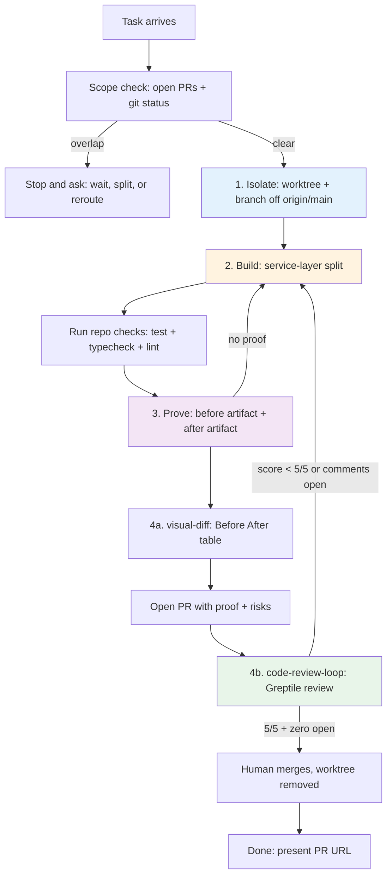
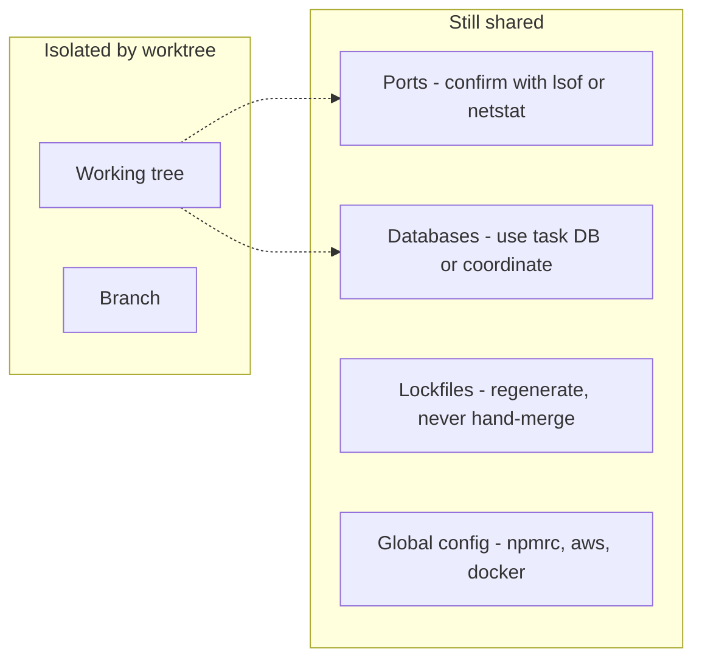
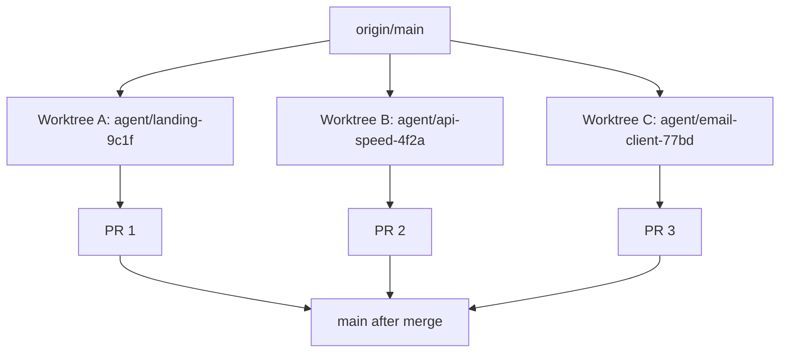
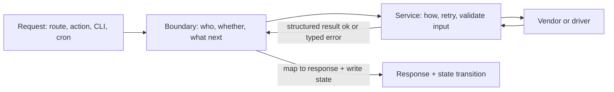
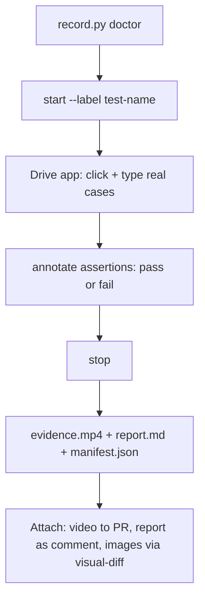
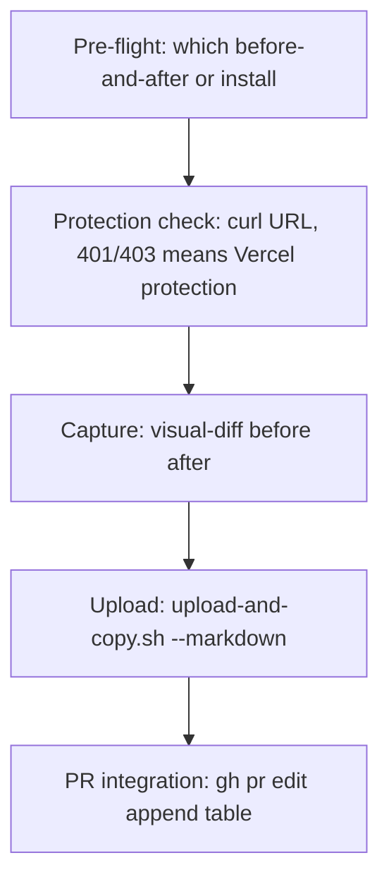
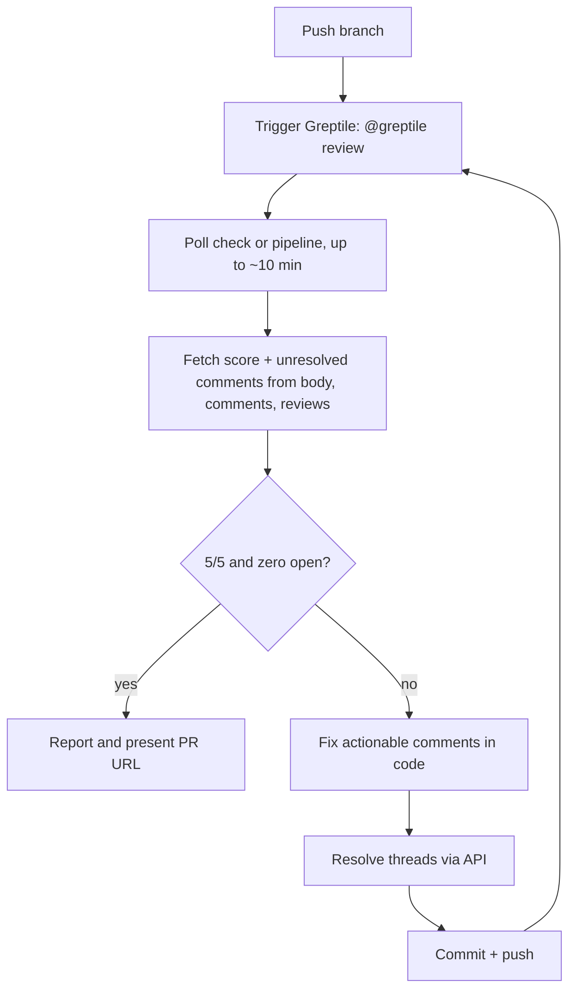
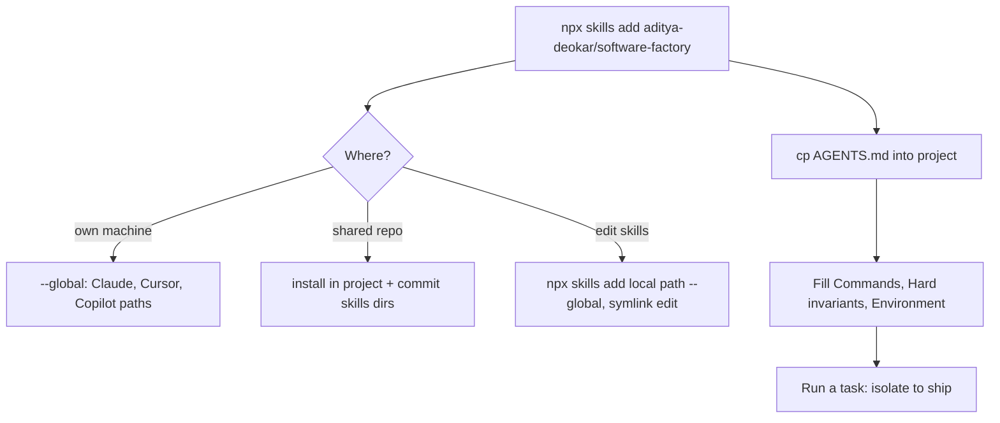

# How the Software Factory Works

Complete technical explanation of this repo. Companion to `video-script.md`, which is the spoken version. This file is the reference version: what each part does, how parts connect, and where to look in code.

Source of truth: `AGENTS.md` plus the ten skills under `skills/`.

---

## 1. The idea in one paragraph

An agent that says "done and tested" gives you a claim you cannot check. This factory replaces each claim with an artifact: an isolated branch that cannot collide, code placed so one fix lands everywhere, a recording or measurement that shows the behavior, a before/after table in the PR, and a 5/5 review score before merge. `AGENTS.md` sets the order. Skills supply the how.

It is model agnostic and harness agnostic. It works with Claude Code, Cursor, Codex, Copilot, OpenCode, Windsurf, and others because it is workflow plus markdown, not a product.

---

## 2. Repo map

```text
AGENTS.md                        <- the controller, copy into any repo
skills/
  worktree-isolation/SKILL.md    <- Beat 1: Isolate
  service-layer/SKILL.md         <- Beat 2: Build
  test-evidence/SKILL.md         <- Beat 3: Prove
  test-evidence/scripts/record.py<- recorder used by Beat 3
  visual-diff/SKILL.md           <- Beat 4a: Ship (before/after)
  code-review-loop/SKILL.md      <- Beat 4b: Ship (Greptile to 5/5)
  code-review-loop-large/SKILL.md<- Beat 4b variant for huge PRs
  prose-cleanup/SKILL.md         <- cross-cutting, human-readable text
  skill-authoring/SKILL.md       <- meta, write and debug skills
  package-release/SKILL.md       <- meta, publish this package
  cross-platform-shell/SKILL.md  <- meta, Windows and POSIX shells
docs/
  USAGE.md                       <- install and daily use
  BENEFITS.md                    <- honest cost and value per skill
  ROADMAP.md                     <- publishing plan
  video-script.md                <- spoken video version
  how-it-works.md                <- this file
scripts/
  lint-skills.mjs                <- validates frontmatter, layout, paths
  check-package.mjs              <- validates published files and licenses
tests/                           <- recorder smoke tests
```

Install entry: `npx skills add aditya-deokar/software-factory`. Package name: `@software-factory/skills`. See `package.json` and `README.md`.

---

## 3. The controller: AGENTS.md

`AGENTS.md:10-26` defines the four beats:

1. **Isolate** with `/worktree-isolation`. Fresh worktree off `origin/main`. Never build on `main`.
2. **Build** with `/service-layer`. Boundaries own why and when, services own how.
3. **Prove** with `/test-evidence`. Repo checks plus runtime evidence. Capture before while reproducing, then after.
4. **Ship** with `/visual-diff` then `/code-review-loop` (or `/code-review-loop-large` for huge PRs). PR carries before/after proof. Iterate to Greptile 5/5 with zero unresolved comments. End with PR URL.

`AGENTS.md:40-45` adds `/prose-cleanup` on anything a person reads. `AGENTS.md:47-62` adds multi-agent rules: one worktree and branch per task, scope check with `gh pr list` and `gh pr diff`, no force push except `--force-with-lease` on own branch, regenerate lockfiles instead of hand-merging, confirm dev-server port answers your process, keep worktree until merge.

`AGENTS.md:64-81` defines task completion: run checks, assemble evidence, commit, rebase on `origin/main`, push, open PR with what changed plus evidence plus risks, clean prose, run review loop, present URL, do not merge unless told.

When you copy `AGENTS.md` into a project, fill the repo-specific section at the bottom: exact install, dev, test, typecheck, lint commands, hard invariants, environment and secrets. Vague entries produce vague work. See `docs/USAGE.md:64-94` for the template.

---

## 4. End-to-end flow



The two loops are the factory nature. Prove loops back to Build when evidence shows the fix did not land. Ship loops back to Build when Greptile scores below 5/5. The agent does this on its own because the skills say so, not because you re-prompt.

Claim to artifact mapping, from `docs/BENEFITS.md`:

| Claim | Artifact | Produced by |
|---|---|---|
| I tested it | Recording with annotations, `evidence.mp4` + `report.md` + `manifest.json` | `test-evidence` |
| The UI looks right | Before/After table in PR body | `visual-diff` |
| It is clean code | 5/5 Greptile, zero unresolved comments | `code-review-loop` |
| I did not break anyone | Separate worktree and branch, scope check first | `worktree-isolation` |
| It is faster now | Same-input before/after numbers | `test-evidence` |

---

## 5. Beat 1: Isolate

Skill: `skills/worktree-isolation/SKILL.md`.

### Problem

Two agents in one checkout interleave edits even on different branches, because there is one working tree. Result: deleted files, overwritten work, unmergeable branches. Non-technical builders hit this most, because nothing warns them.

### What it does

1. Detects harness help first. Claude Code already provisions under `.claude/worktrees/`. Cursor does the same for `worktree-*` branches. Plain terminal does the full setup. Check with `git rev-parse --show-toplevel` and `git branch --show-current`.
2. Scope check before any edit:
   ```bash
   git fetch origin --prune
   gh pr list --state open
   gh pr diff <number> --name-only
   git status --porcelain
   ```
   If your task needs a file that open work touches, stop and ask. That decision belongs to the human directing work.
3. Setup:
   ```bash
   git fetch origin
   git worktree add ../wt/<task-name> -b agent/<task-name> origin/main
   ```
   Branch from `origin/main`, not stale local `main`. Name for the task with a unique suffix. Put worktrees outside the repo or in a gitignored dir. Then install deps inside the new dir, because worktrees do not share `node_modules` or `.venv`.
4. Teardown after merge:
   ```bash
   git worktree remove ../wt/<task-name>
   git branch -D agent/<task-name>
   ```
   Keep the worktree until the PR merges or closes, so review fixes land on the right branch.

### What it does NOT isolate



Ports: two dev servers both want 3000. Confirm the port answers your process or set one port per worktree. Databases: shared dev DB means your migration is everyone's migration. Lockfiles: take one side then rerun install, for example `git checkout --theirs package-lock.json && npm install`.

### Diagram



Cost is about 30 seconds per task. Value is parallel agents without collision. Skip only for solo single-session work with no parallelism.

---

## 6. Beat 2: Build

Skill: `skills/service-layer/SKILL.md`.

### The two questions

- Will this change if product rules change? Then it belongs in the boundary. Auth, permission, whether to act, user-facing wording, state transition.
- Will this change if the vendor changes? Then it belongs in the service. Retries, SDK calls, timeouts, polling, payload shape.

Code that answers yes to both is doing two jobs. Split it.

### Shape



Rules:

- Boundary calls service. Service never calls boundary, never reads session, never writes domain tables, never decides permission. If a service needs to know who the user is, pass it as an argument.
- Service function: everything arrives as parameters, return is structured (`{ ok: true; ... }` or `{ ok: false; reason; detail }`), failure is in the type, and it does one thing. See `skills/service-layer/SKILL.md:69-87` for the `putObject` example and lines 110-134 for the route handler that stays readable.
- Quick test from the skill: pricing decision, permission rule, and user-facing wording go in boundary. Vendor swap, timeout policy, and payload field go in service. If one function would change for reasons on both sides, it is two functions.

### Ordered extraction

Stop after any step and still have working code:

1. Find real duplication. A change to one should always change the other, else they are coincidental twins.
2. Extract for one caller only. Temporary duplication is fine.
3. Verify that caller with tests, typecheck, and a real run.
4. Migrate the next caller. Differences become parameters, not `if (mode === admin)` branches. Flag params mean a product rule leaked in.
5. Delete originals. Dead copies mislead the next reader.
6. Leave domain logic where it was. Auth and wording move back if they slipped into the service.

### Failure modes

God service (`handleUpload` doing everything), leaky service (writes DB directly so callers cannot test or transact), flag parameter (`skipValidation, asAdmin, silent`), mismatched siblings (throw vs null vs `{ error }` in one module), anticipatory abstraction (service built before the second caller exists).

Skip on prototypes, one-off scripts, and flows about to be deleted. Structure is a bet on repeated change.

---

## 7. Beat 3: Prove

Skill: `skills/test-evidence/SKILL.md`. Recorder: `skills/test-evidence/scripts/record.py`.

### Two rules for every change

1. Capture before first, while the bug still reproduces. After the fix, showing old behavior means stashing everything.
2. Vary one thing. Same viewport, same machine, same input, same warm state. Else the comparison proves nothing.

### Evidence by change kind

| Kind | Evidence |
|---|---|
| Visible UI behavior | Recording of you driving it, annotated with `step`, `pass`, `fail`, `note` |
| Visual with no interaction | Before and after screenshots, pinned viewport |
| Bug fix | Failure reproduced first, then same steps passing |
| Performance | Same measurement before and after, several runs, report spread |
| API or CLI | Request and response, or command and output, both versions, diffed |
| Data or migration | Row counts plus sample, query included |
| Refactor, no behavior change | Suite passing plus the riskiest behavior exercised |

### Recording path



Commands:

```bash
python skills/test-evidence/scripts/record.py doctor
python skills/test-evidence/scripts/record.py start --label "Cart totals with tax"
python skills/test-evidence/scripts/record.py annotate "Added 2 items to cart"
python skills/test-evidence/scripts/record.py annotate "NY tax shows 4.44" --kind pass
python skills/test-evidence/scripts/record.py stop
```

Recording well: annotate the assertion not the click, record failures too, keep 60-90 seconds, slow down slightly, do not narrate code. If `stop` fails, `raw.ts` in the session dir is still playable. If `doctor` reports missing `libx264` or `ass` filter, you need a different FFmpeg build. macOS needs Screen Recording permission. No display means use the headless path.

### Headless and non-visual paths

```bash
npx playwright screenshot --viewport-size=1280,800 http://localhost:3000/cart before.png
# apply change, restart, then
npx playwright screenshot --viewport-size=1280,800 http://localhost:3000/cart after.png
```

Performance: `hyperfine --warmup 3` on same machine, report both numbers and spread. Output: `git stash`, capture to `/tmp/before.json`, `git stash pop`, capture after, `diff -u`. Queries: counts before and after with the query pasted beside the number.

### PR placement

Structure from the skill, proof before explanation:

```markdown
## What changed
One or two sentences.

## Evidence
<video or before/after table>

| Case | Result |
|---|---|
| Cart with 2 items | pass |

## Risks
What could still be wrong, and what is untested.
```

Video cannot upload via `gh`. Drag `evidence.mp4` into the browser comment box. Images go via `visual-diff --markdown`. Do not rehearse after the fact, do not crop failures, do not claim more than captured, and if a change needs no evidence say what you did check in one line.

---

## 8. Beat 4: Ship

Two skills in order: `visual-diff` then `code-review-loop`.

### 8a. visual-diff

Skill: `skills/visual-diff/SKILL.md`. Drives `@vercel/before-and-after` plus `agent-browser`.



Quick reference:

```bash
visual-diff <before-url> <after-url>
visual-diff url1 url2 --mobile
visual-diff before.png after.png --markdown
npx @vercel/before-and-after url1 url2
```

Rules baked into the skill: assume current state is After, never switch branches or assume what before is, do not use `--full` unless asked, ask for the before URL when only one is given, check Vercel protection before capture, resolve `$SKILL_DIR` before calling upload scripts, run POSIX upload scripts from Git Bash or WSL on Windows, set `AGENT_BROWSER_ARGS="--no-sandbox"` in containers where Chrome reports no usable sandbox.

Watch out: default upload host `0x0.st` is public. Fine for marketing pages, wrong for customer data. Pass `--upload-url` or use the gist adapter.

Cost is one command. Value per effort is the highest in the set, because reviewers decide from two images.

### 8b. code-review-loop and large variant

Skills: `skills/code-review-loop/SKILL.md` and `skills/code-review-loop-large/SKILL.md`.



Details:

- Inputs: PR/MR/CL number optional with auto-detect, `--max-iterations` default 10. Hitting the cap usually means the PR is too large, not that the loop needs more rounds.
- Platforms: GitHub via `gh`, GitLab via `glab`, Perforce via `p4` plus Swarm. Auto-detects remote, with `--vcs` override.
- Exit needs both 5/5 confidence and zero unresolved comments. Parse score patterns like `3/5` from the most recently updated Greptile source, and carry forward the Prompt to fix all with AI section even when inline endpoint returns zero.
- Each fix cycle: read file in context, fix actionable items, note false positives but still resolve, commit as `address greptile review feedback (code-review-loop iteration N)`, push, re-trigger.
- Use `code-review-loop-large` when Greptile refuses with too many files changed. It tags `@greptile-apps`, which bypasses the file-count limit. Descriptions overlap by design, so name the skill explicitly when the agent picks wrong.

Both need Greptile installed on the repo. Without it they have nothing to talk to. Cost is Greptile plus wall-clock review cycles. Value is boring issues fixed before a human reviews: naming, error handling, null checks, edge cases.

---

## 9. Cross-cutting: prose-cleanup

Skill: `skills/prose-cleanup/SKILL.md`.

Runs on commit messages, PR titles and bodies, docs, code comments, and closing replies, before commit, post, or send. Only on text you wrote or changed.

Four-step loop: scan for 31 patterns, rewrite with meaning kept, add voice, self-audit for what still looks machine-made. Patterns include puffery, filler, hedging, chatbot phrases, AI vocabulary like delve and leverage, em dash overuse, colon as connector, bold-label lists, emoji overuse, passive voice, rule of three, synonym cycling.

Cost is nothing, no tools. Frequency is highest, because it touches every human-readable line.

---

## 10. Supporting skills

| Skill | When to reach for it |
|---|---|
| `skill-authoring` | Writing a skill, or installed skill never fires. Almost always the description, not the body. |
| `package-release` | Cutting a version. Scoped publish needs `--access public`. Published versions cannot be republished. Renaming a skill folder is breaking. |
| `cross-platform-shell` | Command fails on Windows, or scripts must run on Linux, macOS, and Windows. PowerShell 5.1 traps, POSIX table, path and line-ending rules. Reason `.gitattributes` exists here. |

Quality gates: `node scripts/lint-skills.mjs`, `node scripts/check-package.mjs`, `python -m pytest tests/ -q`, `npm pack --dry-run`. Linter runs on `prepublishOnly` so a broken skill cannot reach npm. Combined command from `package.json`: `node scripts/lint-skills.mjs && node scripts/check-package.mjs && python -m pytest tests/ -q`.

---

## 11. Install and wire-up



Windows note: CLI symlinks by default and Windows blocks them without Developer Mode or elevated shell. Use `--copy` on failure. Copies need `npx skills update` to track changes.

Minimal `AGENTS.md` bottom section, from `docs/USAGE.md`:

- Install, dev server plus port, tests, typecheck, lint, with exact commands.
- Hard invariants: generated dirs, DB access path, input validation.
- Environment: Node and package manager versions, DB location and seed, env file source. Ask for secrets, do not invent them.

---

## 12. Full vs lite: when to run what

Full four beats for: multiple agents on one repo, work another person reviews, UI work, long-lived codebases, anything with your name on it.

Lite path for: one-line typo, prototype you delete this week, solo work nobody reviews, repos without Greptile for the review skills specifically.

Rule from `docs/USAGE.md` and `docs/BENEFITS.md`: `AGENTS.md` describes the maximum, not the mandatory minimum. A process you resent is one you abandon.

---

## 13. Limits and honest tradeoffs

- Adds minutes per task: worktree setup, recording and encode, review cycles.
- Needs external tools you do not bundle: Node 18+, `gh` or `glab`, Greptile on the repo, FFmpeg with `libx264` and `ass` filter for recording, Playwright for headless, Chrome for visual-diff, Python 3.9+ for `record.py`. See `NOTICE.md:93-100`.
- Vendored skills drift from upstream. External tools change flags. Budget upkeep.
- A skill is instructions. An agent can read and still do otherwise. This raises the floor, not a guarantee.
- `visual-diff` default upload is public. `code-review-loop` pair overlap in trigger text by design. Recorder does not support GNOME or KDE Wayland; wlroots needs `wf-recorder`.
- Licenses: root MIT covers original work, scripts, and docs. `code-review-loop`, `code-review-loop-large`, and `prose-cleanup` stay MIT with upstream files. `visual-diff` is PolyForm Shield 1.0.0, source-available not OSI open source, keep its LICENSE and do not build a competing screenshot product from it. See `NOTICE.md`.

---

## 14. File index for the video

Show these on screen in this order:

1. `README.md:24-34` - four beats table.
2. `AGENTS.md:10-26` - workflow the agent follows.
3. `skills/worktree-isolation/SKILL.md:49-104` - scope check plus setup.
4. `skills/service-layer/SKILL.md:44-64` - boundary versus service shape.
5. `skills/test-evidence/SKILL.md:32-54` - evidence table plus before-first rules.
6. `skills/test-evidence/scripts/record.py` - `doctor`, `start`, `annotate`, `stop`.
7. `skills/visual-diff/SKILL.md:56-78` - capture and markdown commands.
8. `skills/code-review-loop/SKILL.md:78-106` - trigger plus poll cycle.
9. `skills/prose-cleanup/SKILL.md:12-21` - cleanup loop.
10. `docs/USAGE.md:96-170` - task start to finish.
11. `docs/BENEFITS.md:15-26` - claim to artifact thesis.
